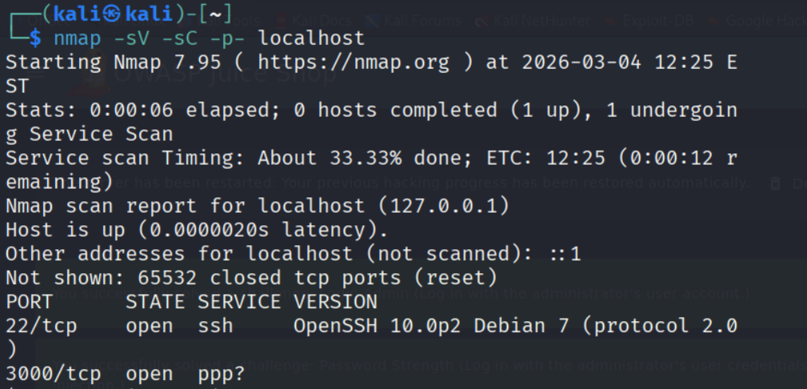
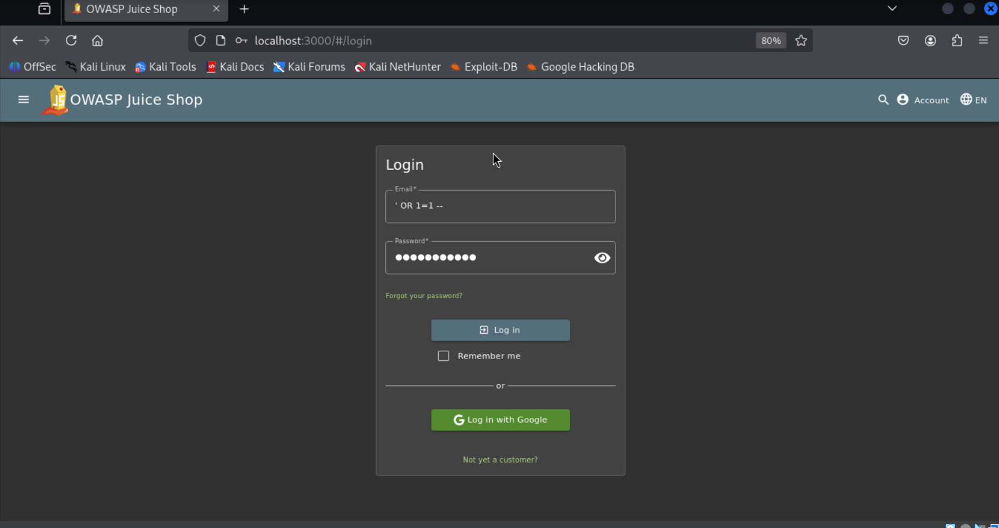
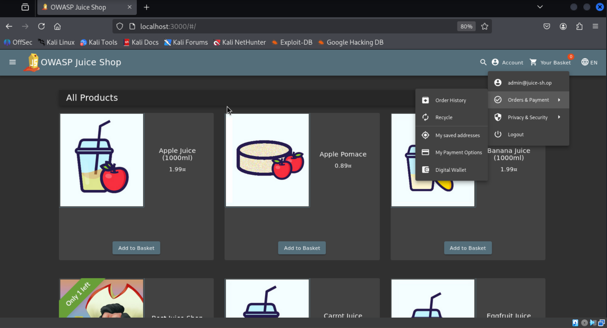

# Web Application Security Testing Lab

This project documents a basic web application security testing exercise performed on OWASP Juice Shop in a controlled lab environment.

## Objective

The goal of this exercise was to practice identifying common web vulnerabilities and understand how authentication mechanisms can be tested.

## Tools Used

- Kali Linux
- Nmap
- Burp Suite
- OWASP Juice Shop

## Testing Performed

## Network Scanning

Command used:

nmap -sV -sC -p- localhost

Result:

PORT     STATE SERVICE
3000/tcp open  http

## SQL Injection Testing

Payload used:

' OR 1=1 --

Result: Login bypass was possible in the lab environment.

## Screenshots

### Nmap Scan

### SQL Injection Login

### Admin Access

## Disclaimer

This testing was performed on an intentionally vulnerable application in a local lab environment for learning purposes.
